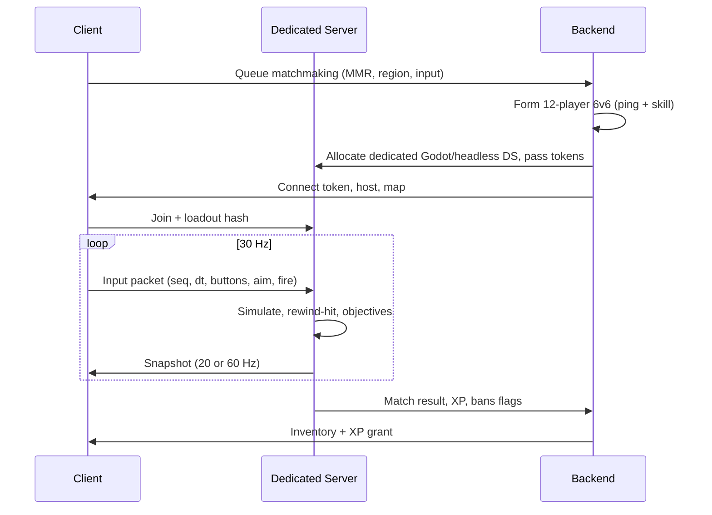
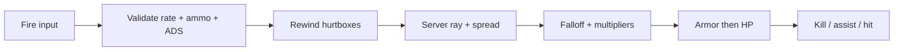

# Multiplayer Architecture

## 1. Model

**Authoritative dedicated server.** The client sends inputs. The server simulates movement, fire, grenades, objectives, scorestreaks, and spawns. The client renders interpolated remote pawns and predicted local pawn.

## 2. Tick and bandwidth

| Channel | Rate | Payload (typical 6v6) |
| --- | --- | --- |
| Client input | 30–60 Hz | 40–80 B |
| Server snapshot | 20 Hz mobile / 60 Hz desktop ranked | 200–600 B compressed |
| Reliable RPC | events | kills, round, streaks |
| Voice | 20 ms frames | Opus |

Snapshot contents: pawn pose (quantized), aim pitch/yaw, action flags, health, weapon id, objective bits. Delta-compressed against last acked snapshot.

**MTU:** keep packets < 1200 B. Split killcam metadata.

## 3. Movement prediction

1. Client samples input, predicts locally using the **same** `CharacterMotor` as server.
2. Server simulates, returns pose + last processed input seq.
3. Client replays unacked inputs on correction. Hard snap only if error > 0.35 m or 12°.
4. Stairs/mantle are server-authoritative; client plays anim, server can reject.

Crouch, slide, tactical sprint stamina are server resources.

## 4. Hit registration (hitscan)

**Rewind lag compensation** on the server:

1. Packet arrives with `clientTime`, `origin`, `aim`, `weaponId`, `fireId`.
2. Clamp RTT/2 + interp delay into rewind window: **120 ms ranked**, **180 ms casual**, never beyond.
3. Rewind remote hurtboxes to that timestamp (bone capsules, 16–20 per soldier).
4. Ray from validated muzzle (must be within 0.45 m of server muzzle after ping).
5. Apply spread from **server RNG seeded per fireId** (client only previews).
6. Damage from `data/weapons.json` falloff at true distance.
7. Broadcast confirmed hit. Client hitmarker is **confirmed**, not predicted, except a local “shot fired” cue.

**Rejected:** client-side hit detection as authority. Web clients are trivial to tamper.

**Projectiles** (launchers, grenades): server-simulated with client visual prediction; detonation is server.

## 5. Anti-cheat

Web is the weakest client. Design assumes the binary is hostile.

| Layer | What |
| --- | --- |
| Sim authority | Hits, ammo, stamina, objectives, FOV-independent traces |
| Rate limits | Fire RPM + 8% slop, grenade throws, slide spam |
| Muzzle clamp | Origin must match possessed pawn |
| Stat anomaly | Headshot % , tracking smoothness, snap histograms (telemetry, not auto-ban alone) |
| Integrity | Native: Play Integrity / DeviceCheck. Web: limited; rely on server |
| Recoil | Server does not require client recoil for hits; spread is server-side. Recoil is presentation + next-shot cone |
| Spectate | Delayed 1.5 s in ranked |
| Reports | After-action, clip attach 12 s |

**Never** trust client HP, ammo, or “I hit him.”

## 6. Matchmaking

**Inputs:** MMR (Glicko-2), region RTT, party size, input device (MnK vs controller — mixed allowed in casual, **separate ladders** in ranked), playlist, cross-play flag.

**Tiers (casual expansion):** expand search every 8 s: ±50 MMR → ±150 → ±300 → fill.

**Ranked:** 6v6 only, party max 3, stricter ping (≤ 70 ms preferred, 110 ms hard).

**Regions:** NA-East, NA-West, EU-West, EU-Central, SA-East, Asia-East, Asia-SE, Oceania, Middle East. Player locked to nearest + one neighbor.

See `data/matchmaking.json` and `packages/server`.

## 7. Cross-platform accounts

One `accountId`. Links: Apple, Google, later Steam/console. Progression, inventory, friends are account-scoped. Loadouts sync. Input-specific aim assist never transfers as a stat advantage — it is device-side.

Guest accounts: 7-day merge window into a linked id.

## 8. Social

- Friends: unique code + platform import.
- Parties: 1–6, leader queues.
- Chat: party, lobby, match all-chat (filter + mute). Ranked match chat: team only.
- Squads: persistent 2–6, shared challenge XP (10%).
- Presence: HQ / queue / match / away.

## 9. Lag and netgraph (player-facing)

HUD option: ping, interp, packet loss. Above 80 ms ping show a small icon. Above 8% loss, disable rewind generosity (fairness).

## 10. Dedicated server ops

- Image: Godot headless Linux (post-V0.1), 1 vCPU / 1 GB RAM per 6v6, 2 vCPU / 2 GB per 20v20.
- Idle recycle: 90 s empty.
- Crash: backend reallocates; players returned to HQ with “server lost” XP consolation (25% of average).
- Tick overrun: if sim > 12 ms, shed VFX replication first, never hitreg.
