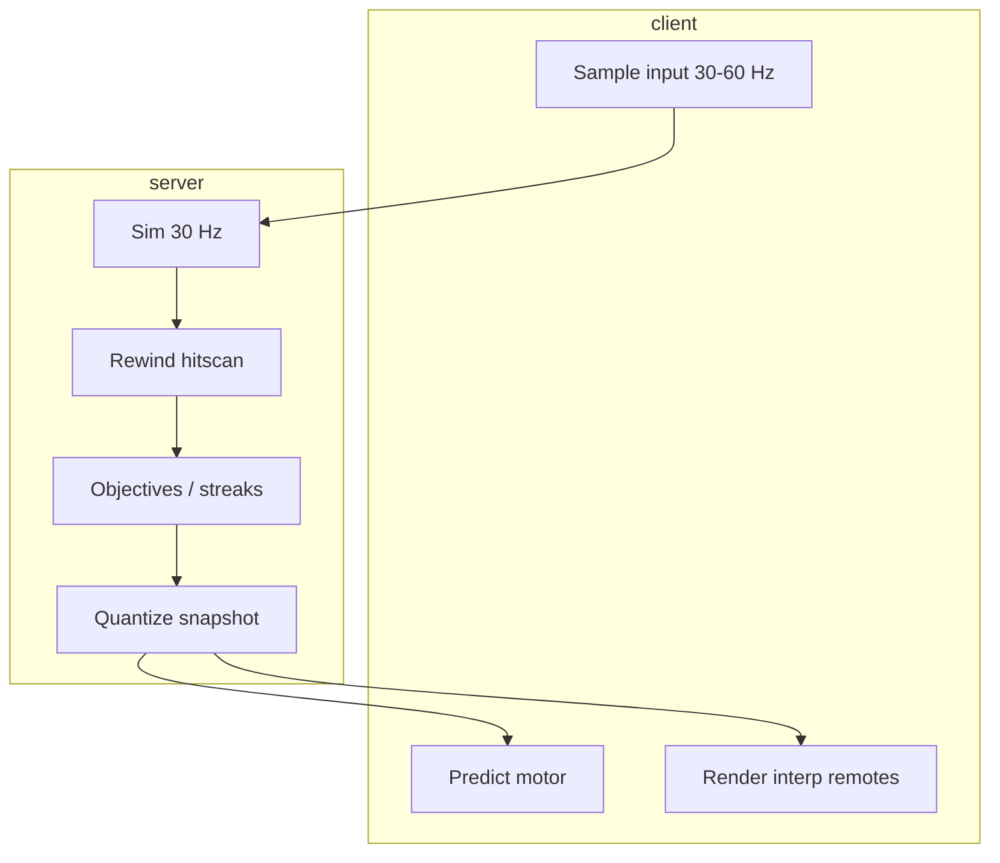
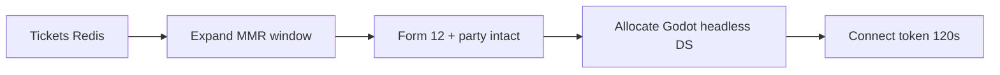
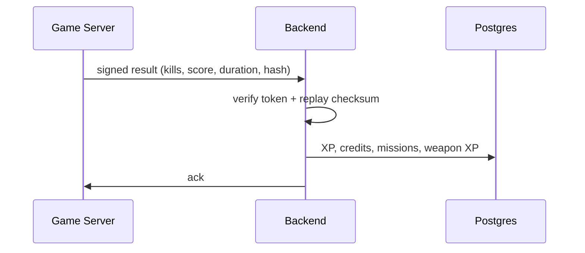

# Networking diagrams (quick reference)

See also `docs/10-multiplayer-architecture.md`.

## Snapshot loop

```mermaid
flowchart TB
  subgraph client
    I[Sample input 30-60 Hz]
    P[Predict motor]
    R[Render interp remotes]
  end
  subgraph server
    S[Sim 30 Hz]
    H[Rewind hitscan]
    O[Objectives / streaks]
    Q[Quantize snapshot]
  end
  I --> S
  S --> H --> O --> Q
  Q --> R
  Q --> P
```

## Matchmaking

```mermaid
flowchart LR
  T[Tickets Redis] --> W[Expand MMR window]
  W --> F[Form 12 + party intact]
  F --> A[Allocate Godot headless DS]
  A --> C[Connect token 120s]
```

## Economy grant (end match)

```mermaid
sequenceDiagram
  participant DS as Game Server
  participant API as Backend
  participant DB as Postgres
  DS->>API: signed result (kills, score, duration, hash)
  API->>API: verify token + replay checksum
  API->>DB: XP, credits, missions, weapon XP
  API->>DS: ack
```
